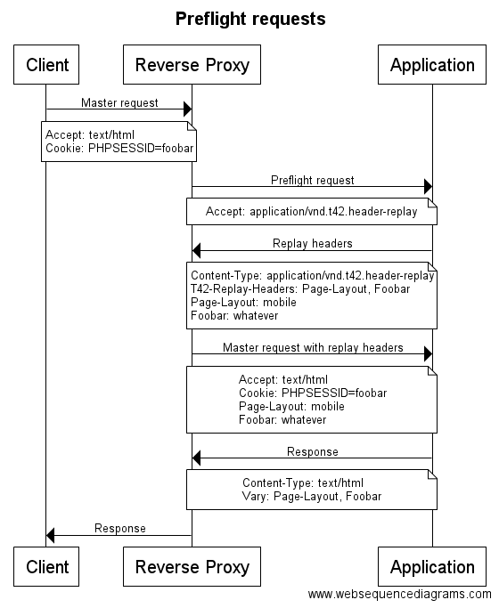

terminal42/header-replay-bundle
===============================

[](https://travis-ci.org/terminal42/header-replay-bundle/)
[](https://coveralls.io/github/terminal42/header-replay-bundle)

What is this?
----

Caching is a very important but also very hard task of any application. Reverse
proxies help us to maintain a shared cache on (or in front of) your web server.
They will cache the responses of your application based on the caching headers
you set such as `Cache-Control` etc. A cache entry always relates to a certain
URI.
At some point, however, you'll find yourself trying to have different cache entries
for the same URI (also think ESI requests here). This is where the `Vary` header
comes into play. By setting `Vary: <header-name>` you can tell a reverse proxy
to add multiple cache entries for the same URI, essentially extending its internal
identifier by not only using the URI but also including the `Vary` headers.

This is great but a lot of stuff - especially in PHP applications - is bound
to PHP session and thus the `Cookie` header that contains the `PHPSESSID` cookie.
Now if you want to `Vary` on something that is part of the session, you would need
to send a `Vary: Cookie` response which basically kills the whole point of a
proxy because not two users will have the same `Cookie` values, right?

What we'd need to do is to split up the data that relates to our PHP session
into multiple headers so we can `Vary` on them separately. Let's work on an
example for that. Think of some legacy application that has no responsive layout
yet and you'd have some desktop and mobile version and you can switch these whereas
the application stores the version you like in your session. Now, as the content
is not the same on mobile and desktop, we need to cache these entries individually.
So having `Page-Layout: mobile` and `Page-Layout: desktop` and the corresponding
`Vary: Page-Layout` headers on the response would solve our problem.
But no browser is going to send you the `Page-Layout: mobile` header on the initial
page view because where should it know that from and the reverse proxy will thus
only ever consider one of your page layouts. Bummer!

Of course, there is a solution to it. I call it "preflight request" but I haven't
found a clear definition for it yet, but the concept is simple:




1. Client sends request to server.
2. Proxy intercepts the request to try to serve from the cache.
3. Based on some conditions (usually `Cookie` or `Authorization` headers) the proxy executes a "preflight request" to the real application.
4. The real application notices it's just a "preflight request" and replies with the "replay headers" (in our example `Page-Layout: <value-based-on-session>`)
5. The proxy "replays" the headers of the preflight request onto the real request and starts over.
6. Now the proxy checks the internal cache again if a cache entry wanted to `Vary` on `Page-Layout` and correctly serves different versions for the same URI.

You can find more information about the concept in the docs of the awesome
[FOSHttpCacheBundle](http://foshttpcachebundle.readthedocs.io/en/latest/features/user-context.html#how-it-works) on top of which this bundle sits.

The `FOSHttpCacheBundle`, however, handles this process only for one specifiy use case which
is the "user context". For the `FOSHttpCacheBundle` there's always only one header
which is the `User-Context-Hash`. Of course, you could include the `Page-Layout` value
in this hash and you could achieve individual cache entries per page layout.
One disadvantage of this approach, however, is that it includes information of multiple
sources in one header again. Remember we said `Vary: Cookie` is not really helpful
because nobody shares the same `Cookie` header value? Of course this is not quite
the same here because you will still have a lot of matches but the rule is simple:

> The more information you include in the same header you want to `Vary` on, the less
cache hits you will get.

This becomes especially interesting when you work with a lot of ESI requests and
your page is made up of many little fragments that `Vary` on different information.
Now imagine you have 10 fragments and only 1 varies based on the user permissions
(`User-Context-Hash`) and the other 9 only `Vary` based on the `Page-Layout`.
If you included all the information in the same hash, the 9 fragments would be
never shared amongst user permissions although they perfectly could!

This is where this bundle jumps in. It allows you to easily register your event
listeners and takes care of replaying them automatically for the Symfony HttpCache.
Unfortunately, for Varnish it still takes manual configuration but we'll get to that.

Installation
============

Step 1: Download the Bundle
---------------------------

Open a command console, enter your project directory and execute the
following command to download the latest stable version of this bundle:

```console
$ composer require terminal42/header-replay-bundle "^1.0" php-http/guzzle6-adapter "^1.0.0"
```

The `header-replay-bundle` sits on top of the `friendsofsymfony/http-cache-bundle`
which requires the virtual package `php-http/client-implementation`.
You can use any client-implementation you like but you have to require one, which
is why in this example we've used `php-http/guzzle6-adapter`.
You can read more about HTTPlug [here](http://docs.php-http.org/en/latest/httplug/users.html). 

This command requires you to have Composer installed globally, as explained
in the [installation chapter](https://getcomposer.org/doc/00-intro.md)
of the Composer documentation.

Step 2: Enable the Bundle
-------------------------

Then, enable the bundle by adding it to the list of registered bundles
in the `app/AppKernel.php` file of your project:

```php
<?php
// app/AppKernel.php

// ...
class AppKernel extends Kernel
{
    public function registerBundles()
    {
        $bundles = array(
            // ...

            new Terminal42\HeaderReplay\HeaderReplayBundle(),
        );

        // ...
    }

    // ...
}
```

Configuration
=============

You'll like to read this. This bundle is a zero-config bundle, so you don't need
to do anything at all.

Usage
=====

1. Register your event listener that should replay a header on the preflight
request. Here's some example code for our `Page-Layout` example in the introduction:

```yml
services:
    app.listener.header_replay.page_layout:
        class: AppBundle\EventListener\HeaderReplay\PageLayoutListener
        tags:
            - { name: kernel.event_listener, event: terminal42.header_replay, method: onReplay }
```

```php
<?php

use Terminal42\HeaderReplay\Event\HeaderReplayEvent;

class PageLayoutListener
{
    public function onReplay(HeaderReplayEvent $event)
    {
        $request = $event->getRequest();
        
        if (null !== $request->getSession() && $request->getSession()->has('page.layout')) {
             $headers = $event->getHeaders();
             $headers->set('Page-Layout', $request->getSession()->get('page.layout'));
        }
    }
}
```

That's it, your `Page-Layout` header is now automatically added on the preflight request
and you can `Vary` on it in your responses. Remember to check the chapter on the
"Proxy configuration" to see if there's more you need to do.

By the way: If you have the requirement to completely bypass the reverse proxy
under certain circumstances just add the `T42-Force-No-Cache: true` header to
the response (better use the class constant `HeaderReplayListener::FORCE_NO_CACHE_HEADER_NAME`)
and that's it. The reverse proxy needs to support this though!

Proxy configuration
===================

### Symfony HttpCache

For the Symfony HttpCache you can use the `EventDispatchingInterface` of the
`FOSCacheBundle` and implement the `CacheInvalidation` interface.
You only need to register the `HeaderReplaySubscriber` provided
by this bundle and the rest just works out of the box for you:

```php
<?php

use FOS\HttpCache\SymfonyCache\CacheInvalidation;
use FOS\HttpCache\SymfonyCache\EventDispatchingHttpCache;
use Symfony\Bundle\FrameworkBundle\HttpCache\HttpCache;
use Symfony\Component\HttpFoundation\Request;
use Symfony\Component\HttpKernel\HttpKernelInterface;
use Terminal42\HeaderReplay\SymfonyCache\HeaderReplaySubscriber;

class AppCache extends HttpCache implements CacheInvalidation
{
    use EventDispatchingHttpCache;

    public function __construct(HttpKernelInterface $kernel, $cacheDir = null)
    {
        parent::__construct($kernel, $cacheDir);
        $this->addSubscriber(new HeaderReplaySubscriber());
    }

    /**
     * {@inheritdoc}
     */
    public function fetch(Request $request, $catch = false)
    {
        return parent::fetch($request, $catch);
    }
}
```

By default, the `HeaderReplaySubscriber` checks for the headers `Authorization`
and `Cookie`. You can adjust this by passing the correct `$options` to the
constructor:

```php
<?php
$subscriber = new HeaderReplaySubscriber(['user_context_headers' => ['My-Header']]);
```

For the special case of `Cookie`, you can also ignore certain cookies if you know
a preflight request is useless for certain cookies. This option takes an array
of regular expressions. If you e.g. want to ignore a cookie named `Foobar`, here
we go:

```php
<?php
$subscriber = new HeaderReplaySubscriber([
    'ignore_cookies' => ['/^Foobar$/']
]);
```

### Varnish

TODO: please help to improve the docs.
